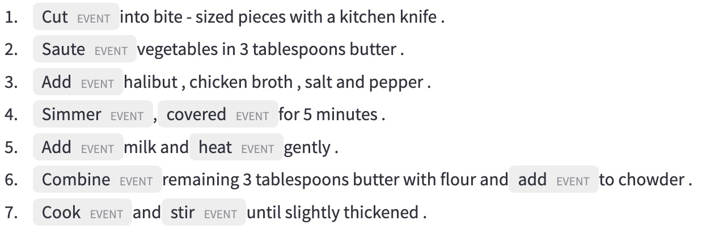
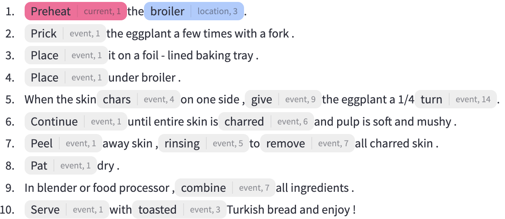
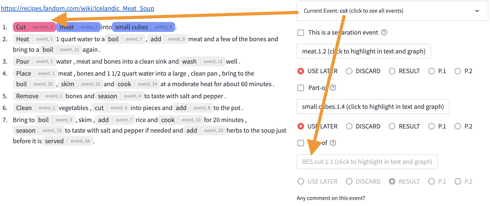
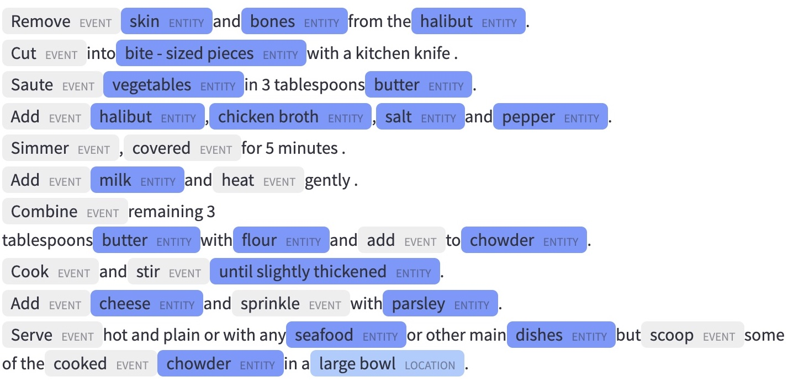
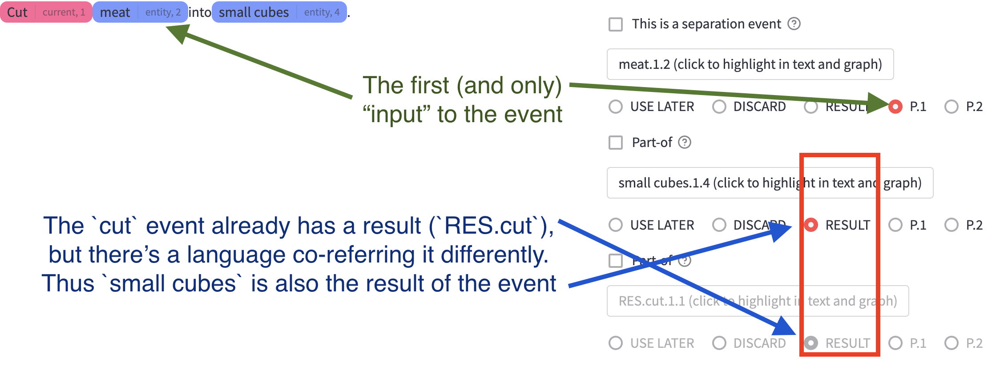
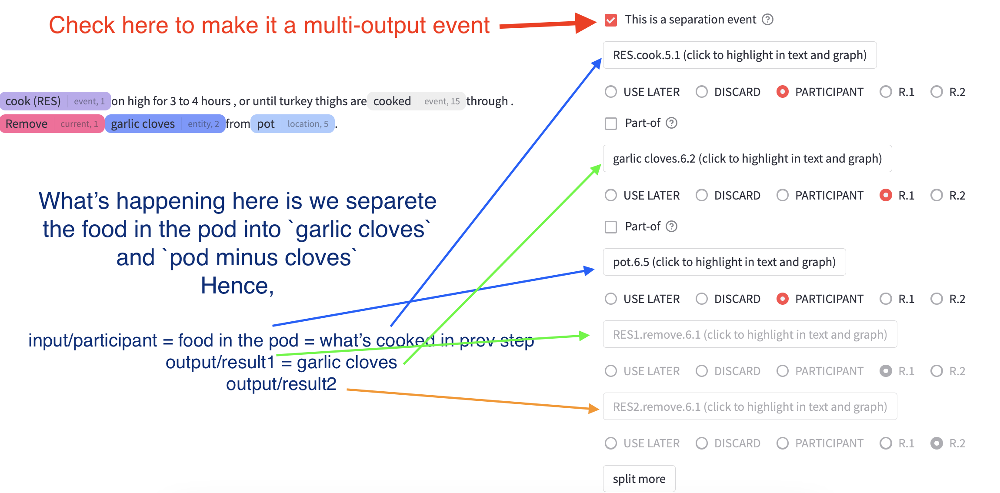

# Annotation Guidelines for the R2VQ+CUTL Corpus

###### Entity Tracking with Coreference Under Transformation Labeling

(last revision: 2022-12-29)

## Introduction

This document describes the method used for annotating coreference relations between entities in documents from [the R2VQ corpus](https://r2vq.org/). 
Because this corpus is composed of a genre of procedural narratives, i.e., cooking recipes, this also requires the annotation of event predicates and their semantic type, as the participants in cooking events undergo a change or a transformation.
Procedural texts, such as recipes and assembly manuals, are interesting to NLP researchers for several reasons: they are step-driven narratives requiring minimal temporal ordering recognition; 
as a result, semantic interpretation can focus on the changes that are taking place in the course of a sequence of events in the narrative, while assuming that the events are temporally ordered in a narrative progression, and involve mainly the relations of precedence or overlap.
The goal of the CUTL annotation project is to create a dataset of procedural texts (cooking recipes at the current stage) annotated with the following information:

* Recognition of all events, typed with their semantic class;
* Recognition of all named entities, typed as ingredient, habitat, or tool;
* Identification of all argument relations between an event and its participants;
* Identification of all coreference relations between named entities in the recipe, when they exist.

Since the first two tasks have already been performed in the previous work (R2VQ), the present annotation exercise involves tasks of identifying argument relations and coreference relations, as we explain below. 
But we will start by elaborating how we define events and entities in the CUTL project.

## Document display

The recipe is structured as a document into numbered steps, starting with 1. Each step has at least one event predicate, and often contains more than one. 
Events have been identified and are highlighted, as shown in gray boxes below in the figure.

When you start annotating a document, you will see the first event highlighted in pink, as shown below. 

> **Note**
> The number in the boxes is the token offset of the mention head. You can use this number together with the sentence number to identify the mention in the annotation table. For example, `broiler` mention in the first sentence is identified as `broiler.1.1` in the annotation table.

Also you'll see blue boxes, which are entities. Note that not all entities are highlighted, but only those which are possibly relevant to the current event. 
We will talk in more details about entities later in this document.

## Events and their participants

Now consider the following document with six events: 

1. `Cut` the broccoli into florets.
1. `Chop` the stems into bite-sized pieces.
1. `Saute` onion in 2 tablespoons of olive oil, 
1. `add` chopped vegetables. 
1. and `cook` for 10 minutes over low heat,
1. `stirring` occasionally.

One of the key goals of the annotation task is to identify three types of event-structural information in the text:

* Event predicates (_e_)
* Input entities to an event (_i_)
* Result/output entities from an event (_r_)

Hence if we consider the first event in the above example, we can identify the following information:

* `Cut`\__e_ the `broccoli`\__i_ into `florets`\__r_.

These _i_ and _r_ entities are either explicitly present in the recipe as textual mentions or absent from the recipe, hidden from the surface text. 
This arises from either an null-argument elision mechanism (e.g., the missing object of cook) or the lexical semantics of the verb, whereby a result phrase is left shadowed and not expressed in the sentence 
Take a look at `saute` event in the above 

* `Saute`\__e_ `onion`\__i_ in 2 tablespoons of olive `oil`\__i_ (and get `sauted onion`\__r_).

Given that, two very critical assumptions to keep in mind for the annotation; 
a recipe is written in a way that the order of appearance of these event predicates (in text) matches the temporal order of actions to take. 
Second, every cooking event in a recipe is assumed to have an implicit result, regardless of whether it’s mentioned in the sentence or not.

More specifically, with the first "temporal order" assumption, if you find a recipe that has sentences written in temporally reversed order, you should not annotate it, and report it using the reporting interface. 
However, when two events are overlapping in time (i.e., happening simultaneously, as in `cook` and `stirring` events in the above), you should annotate both events as if they are happening in linear order. 

> **Warning** 
> Because of this assumption, it is recommended that when you start to work on a new document, __you first read through the whole document carefully and make sure that the events are written in "annotat-able" order__.

As for the second assumption, because our model assumes there always going to be at least one result for every event, in the CUTLER interface, you will see __an automatically generated result entity for each event, shown in `RES.verb` form__.
See this picture below:

## Entities and errors in pre-annotation, Error reporting

In the pre-annotated corpus, roughly speaking we have three types of entities, based on their role in kitchen. 1) food, 2) space/location, and 3) tools/props. 
However, in the CURL annotation scheme, __we consider only two types of entities__.
One is food entity, and the other is location entity. 
Hence, when you see a tool/prop entity in the annotation table, you can ignore it by choosing "discard" option in the annotation interface.

Location entities are simple; they are names of physical spaces in a kitchen that cooking activities occur. 
Food entities are any nominal phrase that refer to raw ingredients, the final dish name, intermediate food states, or other referring expressions of food or a property of food (temperature, shape, size, weight, etc). 

See this table for examples of different types of entities.

|Type | Examples |
|---|---|
|Location | pot, pan, skillet, oven, board, sink, ... |
|Raw ingredients | beef, onion, salt, water, ... |
|Food states | soup, dough, pizza, egg mixture, ... |
|Pronouns and quantifiers | it, them, half, ... |
|Food property | Roll dough into `balls` (shape)   Cook `both sides` of the meat (part) |

These entities are already identified in the previous work (R2VQ). In the CUTLER interface,
location entities in light blue color, while all other entities will appear in dark blue color. This image below shows an example of all entities highlighted.

> **Note** 
> Even though the number of entities shown in the figure might seem overwhelming, in an actual environment you will be presented only a subset of entities that are relevant to the current event you are looking at, to help you focus on the task.

Now, the pre-annotation is not perfect and there could be some error in the entity span shown in CUTLER. 
So when you find an error in the entity span, we must flag the document as problematic using the report button presented in the interface. 
These are kinds of errors you need to report: 

1. Missing spans:
    * error: `Remove`\__e_ the garlic from the `skillet`\__l_ with a slotted spoon and `transfer`\__e_ to a paper towel.
    * correct: `Remove`\__e_ the `garlic`\__f_ from the `skillet`\__l_ with a slotted spoon and `transfer`\__e_ to a `paper towel`\__l_.
1. Short spans:
    * error: `Peel`\__e_ `potatoes`\__f_ and `slice`\__e_ into `french fry`\__f_ shapes.
    * correct: `Peel`\__e_ `potatoes`\__f_ and `slice`\__e_ into `french fry shapes`\__f_.

When you report an error, the last step you were working on will automatically reported as well. However, be as specific as possible in the report body about problem you found. 

## Using annotation table

For every recipe, you will annotate each step separately. 
A step includes a cooking verb and some number of ingredients, and a possible result. 
If the step includes more than one event, then each event is annotated separately.

### Argument linking 

The first task is to select the appropriate participants to the cooking event being annotated. For this you will be using the radio buttons shown under each entity mention on the right side of the interface, which we call _annotation table_. 
Commonly, you will see three options: `discard`, `later`, and `result`.
Then you will also see `P[1-N]` options. `P` here stand for participant. `N` is determined by the number of candidate entities in the current step.

* `discard`: This option is used when the entity is not of our interest. For example, if you see a tool/prop entity, you can discard it. Or if this food entity is no longer used in the cooking process, you can discard it. (e.g., pitted stone from an avocado)
* `later`: This option is used when the entity is used in the cooking process, but not in the current step. For example, if you see a food entity that is used in the next step, you can choose this option.
* `result`: This option is used when the entity is the result (OUTPUT) of the current step.
* `participant`: This option is used when the entity is a participant (INPUT) of the current step.

> **Note**
> As mentioned earlier, CUTLER will automatically generate a result entity for every event. So you will see `RES.verb` entity in the annotation table, pre-selected as `result`. You can't change this selection.

### Coreference linking 

When you pick the same radio button for two entity mentions (including `RES.verb` entities), namely, if you put multiple entities on the same "column", you are saying that these entities are coreferent. See this picture for an example. The red box shows the coreference link between `RES.cut` and `small cubes` entities.

### Metonymy (location) annotation

In the previous section, we talked about types of entities we are interested in, including location entities. However, we are not interested in all location entities, but only those that are used as a metonymy for a food entity. 

> **Note**
> Metonymy is a figure of speech in which a thing or concept is referred to by the name of something closely associated with that thing or concept. For example, in the sentence "The White House announced today that ...", the White House is a metonymy for the president and his staff.

Here's an example;

1. In a separate `pan`\__l_, cook meat. 
1. Once the meat is browned, add sauted vegetables to the `pan`\__l_.

In the first sentence the `pan` is just a physical space that you use to cook meat. However, in the second sentence, the `pan` is used as a metonymy for the meat, so when you "add vegetables to the pan", you are actually adding vegetables to the meat.

So if a location entity is not used as metonymy, you can discard it. This means, by definition, all annotated location entities are used as a kind of coreference, and hence __there must be another entity in the same "column" of the annotation table, when you mark a location entity as `participant`__.

### Multi-input events

When you see a event that involves more than one participant, you can simply pick different `P[1-N]` options for each participant. However, note that 

1. if you select the same participant number, you are saying that they are coreferent.
1. CUTLER cannot handle disjunctive NP. In these cases, you need to treat them as separate entities. For example, in the following sentence, you need to annotate `salt` and `lemon salt` as separate entities (These two entities are not coreferent). Handling of disjunctive NP will be done in post-processing. 
    * `Season`\__e_ with `salt`\__p1_ or `lemon salt`\__p2_.

### Multi-output events

Most events you'll see in the corpus will have only one result. However, there are some events that have more than one result. 
We call them _separation events_. 
Here's an example;

Notice that, when you check the separation event, you will see two `RES` entities in the annotation table. If the event has more than two results, you will see more by using [split more] button. Here's an example of three-way separation event.

* `Remove`\__e_ `skin`\__r1_ and `bones`\__r2_ (and `∅`\__r3_ = fish minus skin minus bones) from the `halibut`\__p_.

For multi-output separation events, we always assume there's only one "input"/"participant" entity. So for these events, you will see `R[1-N]` options instead of `P[1-N]` options, and `participant` option instead of `result` option in the annotation table. 

### Meronymy annotation

You might have noticed by now that for each row in the annotation table there's a `part-of` checkbox. This checkbox is used to annotate meronymy relations. 

> **Note** 
> Meronymy is a semantic relation between a meronym denoting a part and a holonym denoting a whole. For example, finger is a meronym of hand, which is its holonym.

In the CUTL project, we define meronymy as a sub-type of coreference. Namely, if you check the `part-of` checkbox for two entities, you are saying that these two entities are coreferent, but one is a part of the other. For example, even after you stir-fry chicken and some vegetables together, but one can still refer that mixed cooked dish as simply "chicken". 

In the first rounds of annotation we found that annotators were confused about the difference between meronymy and separation events. 
Conceptually if two entities are physically separated by an event, they are not meronyms. Here's an example of a confusion case.

1. Boil potatoes in their skins until very tender.
1. Peel while still warm.

In the first sentence, the `potatoes` are cooked in their skins, which means the `potatoes` are not separated from their skins. Hence, the `skins` are meronyms of the `potatoes`.
In the second sentence, the `potatoes` are peeled, which means the `potatoes` are separated from their skins, but we can't find a textual extent (or coreferential span) for the `skins`. In this case, you can use "separation event" annotation and immediately check the `discard` one of the results (taking it as skins, and the other as skinless potatoes). Or you can simply take `peel` as a single-input, single-output event. 

> **Note**
> In the post-processing, we will trim the child nodes from multi-output events without further reference, so both ways of annotating the second sentence will be treated as identical. 

### "Light" events

In CUTL, we define "light" events as events that do not have any participants. For example, in the following sentence, `preheat` is a light event, because the `oven` is not a metonym and can't be a participant of the event.

* `Preheat`\__e_ `oven`\__l_ to 350 degrees.

### Non-nominal results

During first rounds of annotation, we found many occurrences of non-nominal result phrases, most commonly as _until_-like clauses. Here's an example;

* Mix in apple sauce and vanilla extract _until a `soft dough` forms_.
* Cook the mussels, _once `shells` open_, take out mussels. 
* Lift fillets set aside on a plate _to drain_.

Usually these non-nominal results are offering some termination condition for the event, and can be paraphrased to "do `X` until `Z` becomes `Y`" (where `X`, `Y` are predicates and `Z` is a nominal entity).
Thus, in most cases, the "subjects" `Z` in the until clause will be actually referring the input or a part of the input of the event `X`. For example in steps like the following,

1. Grate cheese over the sandwich.
1. Grill until cheese melts.

the cheese in the until clause refers to a part of `RES.grate`. 

For these cases, you must draw a coreference link between the `Z` entity and the input entity of the event `X`. However this will "consume" the only participant to the event `Y`, hence when you reach `Y`, you will have to annotate it as a light event. 

## Trivial edge cases

* "Heat control" event (e.g., low heat to simmer, preheat oven to 350 degree) is always a light event.
* "Serve" event is a light event unless it has a side dish (e.g., "Serve with rice").

## Final notes 

* If you are not sure about the annotation, please ask the project manager.
* If you find any bugs in the annotation tool, please open an issue in the annotation github repository.
* If you find a document is not annotatable, use report button in the annotation tool. You can use markdown syntax to write a report body.
